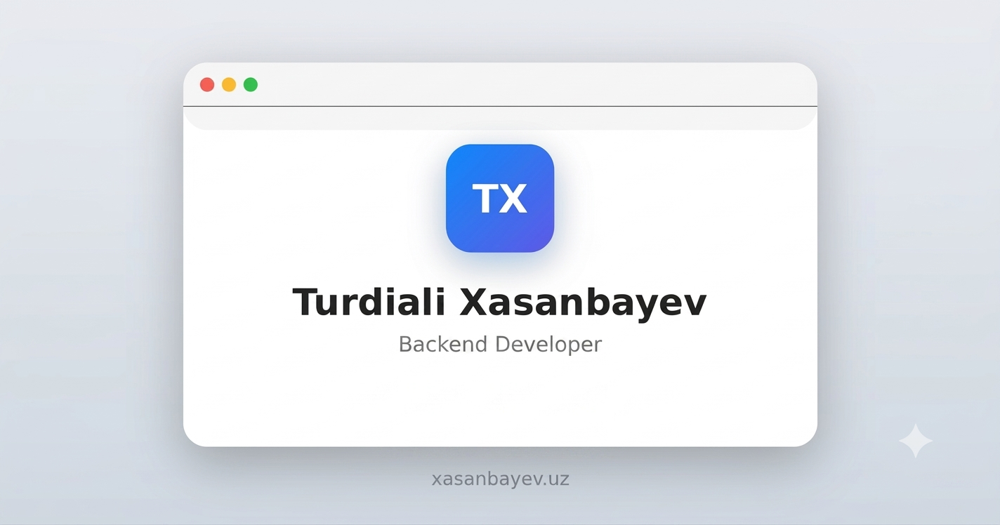

# Turdiali Xasanbayev — Portfolio

A single-page, Apple-inspired personal business card website built with HTML, CSS, and a touch of JavaScript.

🔗 **Live site:** [xasanbayev.uz](https://xasanbayev.uz/)

## Overview

A lightweight, responsive portfolio card presenting who I am, what I work with, and how to reach me — all on a single scroll-free page. Built with no frameworks and no build step, and deployed as static files via GitHub Pages.

## Sections

- **Profile** — name, role, and avatar
- **Skills** — Python, Django/DRF, Git, PostgreSQL
- **Projects** — iqtisodiybilim.uz, xasanbayev.uz
- **Contact** — email, Telegram, GitHub, phone
- **Footer**

## Tech Stack

- HTML5
- CSS3 (Flexbox, Grid, CSS custom properties)
- Vanilla JavaScript (footer year auto-update)
- [Font Awesome](https://fontawesome.com/) for icons

## Project Structure

```
portfolio/
├── index.html
├── favicon.ico
├── favicon-512.png
├── preview.png
└── README.md
```

All styles are kept inline within `index.html` — no separate CSS file needed for a page this size.

## Design

The layout takes cues from Apple's product and interface design language:

- A clean, centered card with soft rounded corners
- A subtle, layered shadow for depth
- A neutral gray-blue palette with a single blue accent
- A rounded gradient avatar badge
- A pill-style social bar for contact links

## Preview



The site features an Apple-inspired design with a modern, minimal aesthetic. It showcases skills, projects, and contact information on a single, responsive card.

## Running Locally

No build tools required. Clone the repo and open `index.html` directly in a browser, or serve it locally:

```bash
git clone https://github.com/turdialixasanbayev/portfolio.git
cd portfolio
python3 -m http.server
```

Then visit `http://127.0.0.1:8000`.

## SEO & Sharing

The page includes meta tags for search engines and social previews (Open Graph + Twitter Card), along with a canonical URL and a custom favicon.

## Deployment

Deployed automatically via **GitHub Pages** from the repository root.

## Contact

- ✉️ Email: [xasanbayevturdiali7@gmail.com](mailto:xasanbayevturdiali7@gmail.com)
- 💬 Telegram: [@turdialixasanbayev](https://t.me/turdialixasanbayev)
- 🐙 GitHub: [@turdialixasanbayev](https://github.com/turdialixasanbayev)

## License

This project is open source and available for personal reference. Feel free to fork it for your own portfolio, but please don't reuse the personal content as-is.
